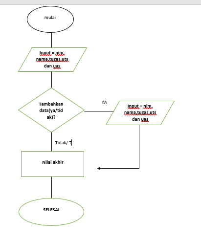
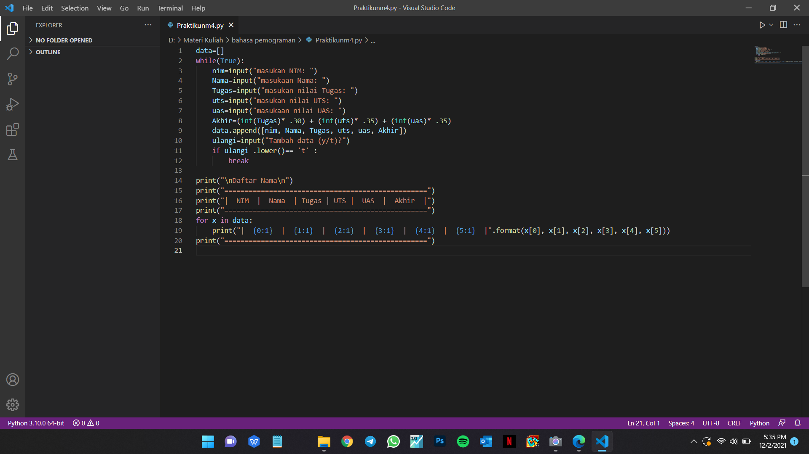
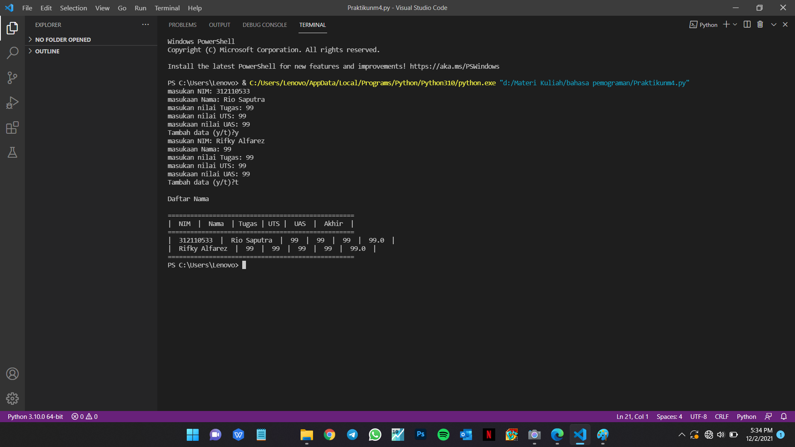

# Praktikum4

## Flowchart
-Penjeasan mengenai program menambahkan data kedalam list

-program ini dibuat menggunakan inputan, perulangan,kondisi dan list

-program ini menginputkan sebuah nama nim dan nilai nilai yang nanti nya akan diproses hitung nilai akhir

-perulangan dan kondisinya digunakan untuk menentukan apakah ingin menambahkan data nilai atau tidak, jika tidak program akan menentukan nilai akhir yang diinputkan
 

 ## INPUT
 

 ## OUTPUT
 
 
